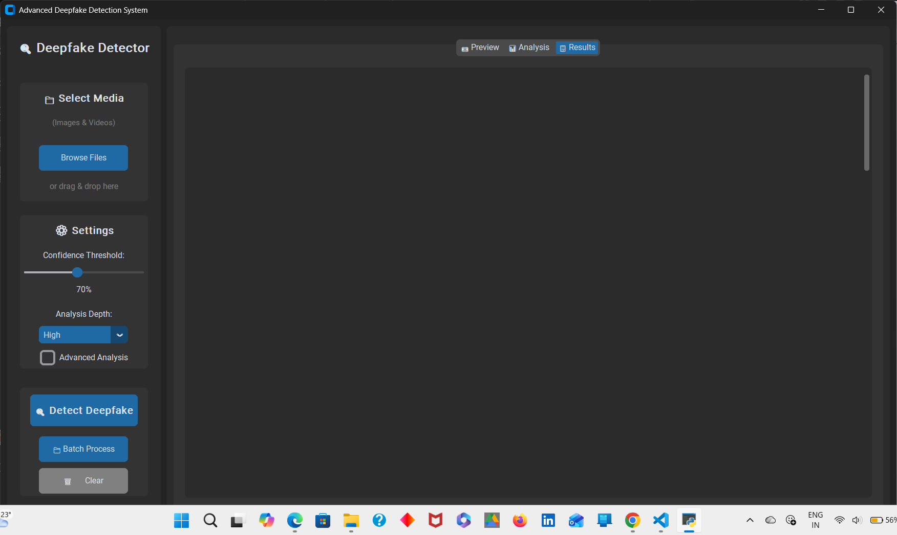
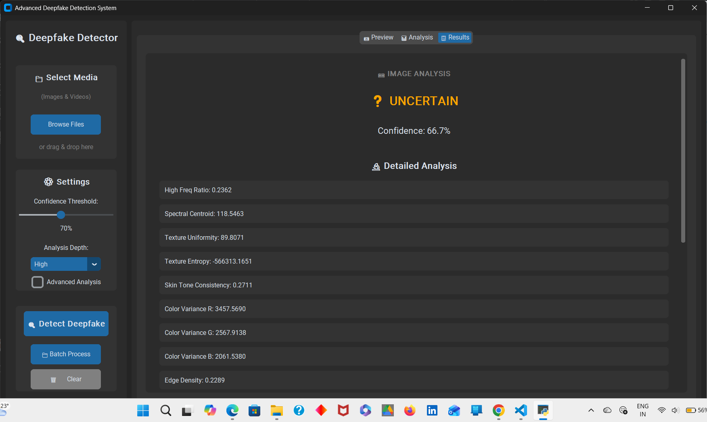

# Deepfake Detection System

An AI-based deepfake detection system for analyzing images and identifying potential synthetic media using machine learning and image processing.

## 📌 Overview

This project provides a desktop-based graphical interface for analyzing images and videos for potential deepfake manipulation.

The system performs face detection and extracts multiple image characteristics, including frequency, texture, color, edge, and compression-related features.

## ✨ Features

- Image and video input
- OpenCV-based face detection
- Feature-based deepfake analysis
- Confidence score
- REAL / FAKE / UNCERTAIN / NO FACE results
- Image preview and video information
- Detailed feature analysis
- Feature visualization charts
- Batch processing of multiple media files
- Adjustable confidence threshold
- Adjustable analysis depth
- Dark-themed desktop GUI

## 🖥️ Interface



## 📊 Detection Results



## 🛠️ Technologies Used

- Python
- CustomTkinter
- OpenCV
- NumPy
- Matplotlib
- Scikit-learn
- Pillow

## 📂 Project Structure

```text
Deepfake-Detection-System/
│
├── advanced_deepfake_gui.py
├── requirements.txt
├── INTERFACE.png.png
├── RESULT.png.png
├── .gitignore
└── README.md
